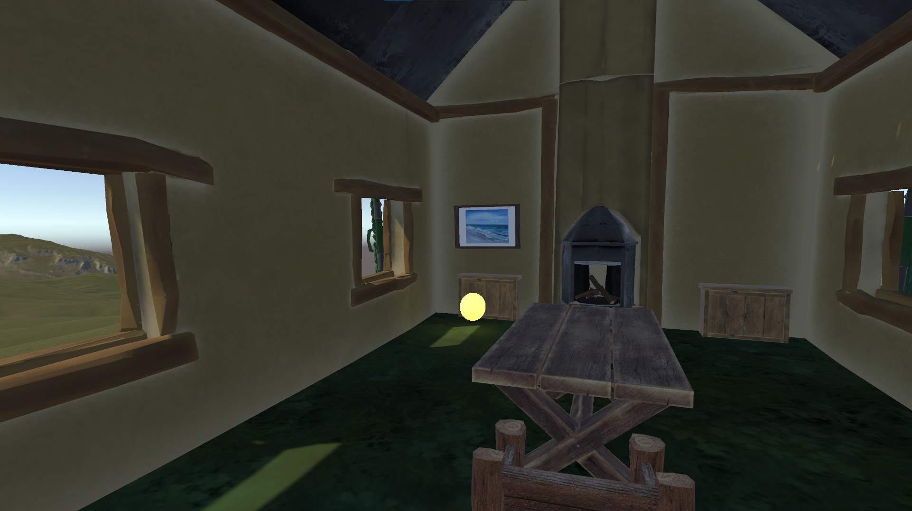
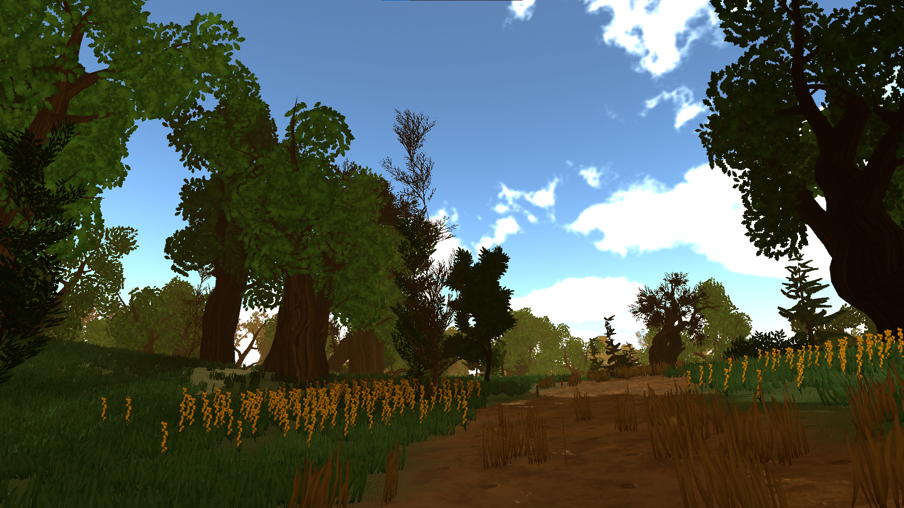
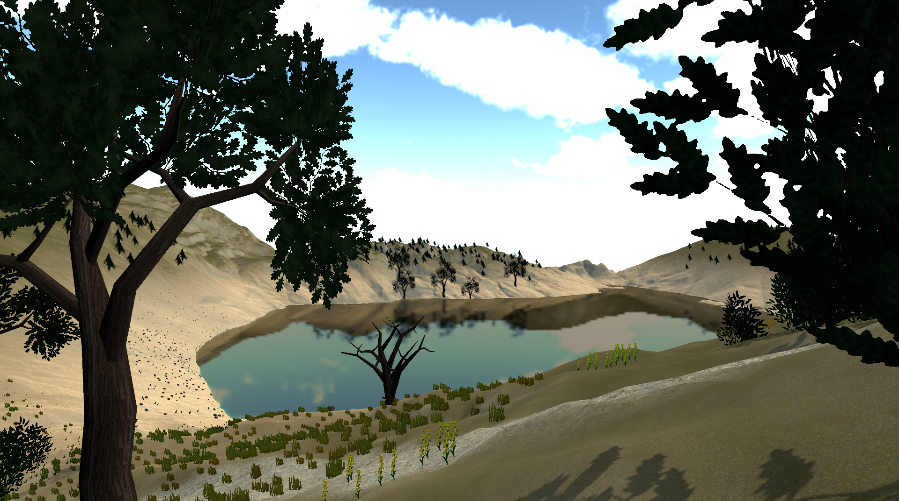

# VR-Game-for-Thalassophobia
A Virtual Reality game for fighting the fear/phobia of large bodies of water. It's made in Unity and consists of 3 Levels(played on PC). 

The player can move with the arrows and jump with space. 

Just run the **game.exe** file to start the game.

# Level 1
Goal: getting closer to the picture of the sea
The player is in a house and has to follow the yellow light bulb, which means standing in front of a painting of the sea, waves. 
Only when this is achieved, the player can leave the house.

# Level 2
Goal: following a path and hearing the sound of waves, getting louder
The player wakes up in a forest and hears birds and a waves in the background.
He has to follow the path through the woods as the waves get louder, till the path ends.

# Level 3
Goal: getting close to the shore and hearing the waves and seagulls
The player wakes up on a hill, surrounded by lakes, he seagulls birds and a waves in the background. 
He has to follow the path through which leads to the shore and has to get close to the water, stand there a few seconds so that this level is completed.

